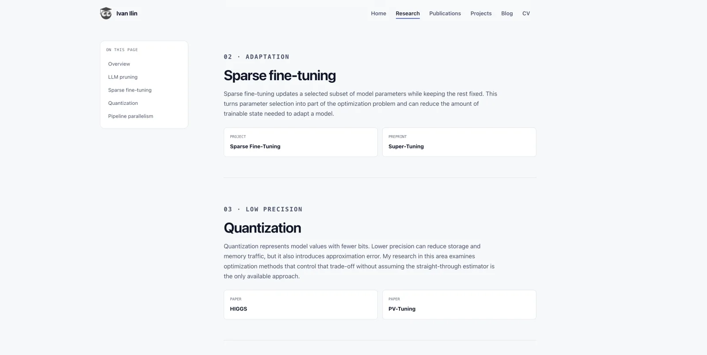
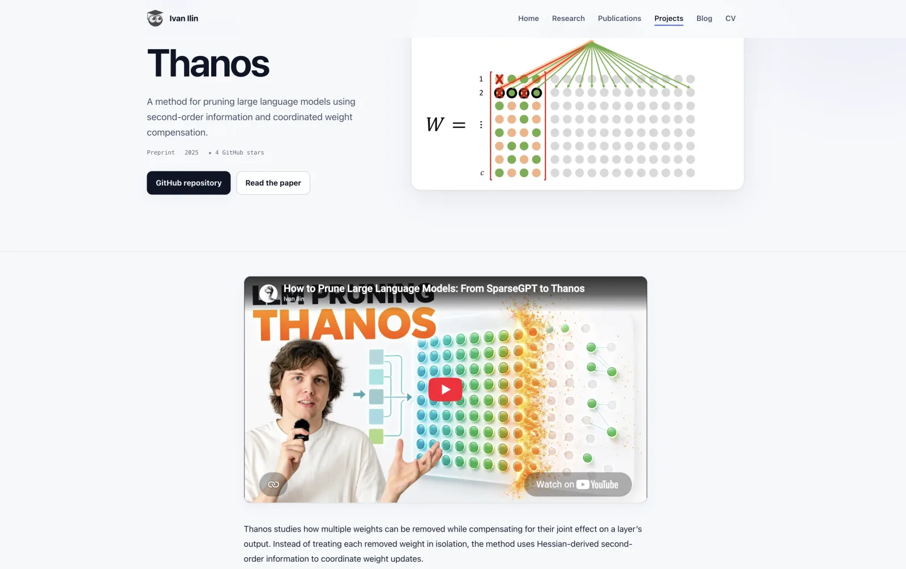

<div align="center">
  
  <h1>Ivan Ilin · Academic & Engineering Website</h1>
  <p><strong>Machine learning research, publications, projects, and technical writing in one fast, maintainable website.</strong></p>
  <p><code>Astro</code> · <code>TypeScript</code> · <code>Content Collections</code> · <code>GitHub Pages</code></p>
</div>


This is the source code for the personal website of Ivan Ilin, a machine learning researcher and PhD candidate in Computer Science at KAUST. It brings research areas, verified publications, engineering projects, build-time profile metrics, and Markdown writing into one maintainable Astro codebase.

The site is deliberately static-first: primary content is delivered as HTML, interactive behavior uses small vanilla-JavaScript enhancements, and external metrics are collected securely during the build rather than requested by a visitor's browser.

## Highlights

- structured, type-checked collections for publications, projects, and blog posts;
- build-time GitHub and verified Google Scholar metrics with safe cached fallbacks;
- project pages with research figures, repository links, papers, and embedded media;
- responsive, accessible design with a light-only visual system;
- RSS, sitemap, canonical URLs, social metadata, and structured data;
- automated checks, metric refreshes, and deployment through GitHub Actions.

## More pages

<table>
  <tr>
    <th width="50%">Research</th>
    <th width="50%">Project detail</th>
  </tr>
  <tr>
    <td></td>
    <td></td>
  </tr>
</table>

## Stack and architecture

- Astro 7 with static site generation
- strict TypeScript and Astro Content Collections
- Markdown/MDX for posts, projects, and publications
- plain CSS and small vanilla-JavaScript interactions
- a light-only interface with no stored theme preference
- KaTeX for equations and Shiki for code highlighting
- build-time GitHub and Google Scholar profile metrics
- RSS, sitemap, robots metadata, JSON-LD, Open Graph, and Twitter cards
- GitHub Actions and GitHub Pages deployment

There is no runtime backend, database, browser-side API request, React application, or exposed token. Primary content is rendered to static HTML.

## Local setup

Node.js 22 and npm are recommended.

```bash
npm install
npm run dev
```

The development server prints its local URL. Other commands:

```bash
npm run check       # Astro and strict TypeScript diagnostics
npm run metrics     # Refresh configured public metrics
npm run build       # Sync domain files, refresh metrics, and build dist/
npm run build:site  # Build from the current generated metrics without refetching
npm run preview     # Preview the production build
```

Use `npm ci` in clean or automated environments. The lockfile is committed.

## Content structure

```text
src/
  components/             Shared Astro components
  content/
    blog/                  Markdown or MDX posts
    projects/              Project entries and long descriptions
    publications/          Publication entries and summaries
  data/
    profile.ts             Canonical profile and domain configuration
    research.ts            Homepage research areas
    generated/metrics.json Build-time metrics cache
  layouts/                 Page shell and metadata
  pages/                   Static routes
  styles/                  Global design system
scripts/
  fetch-metrics.ts         GitHub and citation-metrics integration
  sync-domain.ts           Generates CNAME and robots domain values
public/                    Static assets
docs/images/               Optimized screenshots used by this README
```

Collection schemas live in [`src/content.config.ts`](src/content.config.ts). Optional URLs are omitted from the interface when absent.

## Profile links and domain

Edit [`src/data/profile.ts`](src/data/profile.ts) to change the name, role, biography, portrait, site URL, GitHub username, email, professional profiles, CV, or metric sources. Empty optional strings are intentionally hidden. The homepage portrait is stored at `public/images/ivan-ilin.webp` and referenced by `profile.portraitUrl`.

`profile.siteUrl` is the canonical domain source. `npm run build` runs `scripts/sync-domain.ts`, which derives `public/CNAME` and the sitemap URL in `public/robots.txt` from that value. Do not add an Astro `base` path while the site uses a custom root domain.

Set `siteUrl` to the deployed origin before publishing. Fill optional profile fields only when their values have been verified; leaving them empty removes the corresponding interface elements.

## Add a blog post

Create a `.md` or `.mdx` file in `src/content/blog/`:

```yaml
---
title: A precise post title
description: One sentence used in cards and search metadata.
publishDate: 2026-08-03
updatedDate: 2026-08-10
tags:
  - Optimization
  - Open source
draft: false
featured: false
cover: ../../assets/example-cover.png
---
```

The filename becomes the URL slug. Drafts are excluded from production lists, static production routes, RSS, tag pages, and the sitemap. Reading time is computed from the body. Markdown supports tables, fenced code blocks, inline math such as `$x^2$`, and display equations with `$$...$$`.

## Add a project

Create a Markdown or MDX file in `src/content/projects/`. Put the long description in the body:

```yaml
---
title: Project name
shortSummary: A short, factual summary.
year: 2026
status: Active
category: Research / Optimization
topics:
  - Optimization
featured: true
githubUrl: https://github.com/owner/repository
paperUrl: https://arxiv.org/abs/0000.00000
demoUrl: ''
image: ../../assets/projects/project-name.webp
imageAlt: A concise description of the project image
imageFit: cover
visual: matrix
metricsRepository: owner/repository
relatedPublications:
  - publication-file-slug
---
```

Remove unknown optional fields instead of publishing placeholders. Store project media in `src/assets/projects/`; use `imageFit: contain` for diagrams or transparent artwork and `imageFit: cover` for photographs and screenshots. When no image is available, omit the image fields and select one of the abstract `visual` options instead. Add a repository to `profile.repositories` if its stars, forks, language, and update time should be fetched during builds.

## Add a publication

Create a Markdown file in `src/content/publications/`:

```yaml
---
title: "Verified paper title"
authors:
  - Ivan Ilin
  - Coauthor Name
year: 2026
venue: arXiv
publicationType: Preprint
status: Preprint
summary: A short, source-backed description.
featured: false
paperUrl: https://arxiv.org/abs/0000.00000
arxivUrl: https://arxiv.org/abs/0000.00000
codeUrl: https://github.com/owner/repository
projectUrl: /projects/project-slug/
bibtex: |-
  @article{verified-key,
    title={Verified paper title},
    author={Ilin, Ivan and Name, Coauthor},
    year={2026}
  }
tags:
  - Optimization
---
```

The publications page sorts by year, filters by type and topic, and exposes a client-side BibTeX copy action. Do not infer missing authors, venues, identifiers, or acceptance status.

## Add a CV

The CV PDF is stored at `public/cv/ivan-ilin-cv.pdf` and configured with:

```ts
cvUrl: '/cv/ivan-ilin-cv.pdf',
```

in `src/data/profile.ts`. Replace the PDF at the same path when publishing an updated CV. The header, homepage, and About-page links appear automatically while `cvUrl` is configured.

## Build-time metrics

`scripts/fetch-metrics.ts` calls the public GitHub API during a build. Account-wide metrics include:

- stars across all original, non-fork public repositories;
- followers;
- total public repository count, including public forks;
- the last successful refresh time.

The same complete repository listing supplies stars, forks, language, and update time for the selected research repositories used by project cards. Normalized output is stored at `src/data/generated/metrics.json`. A `GITHUB_TOKEN` is optional locally and raises the API rate limit. GitHub Actions passes its automatic repository token only to the metrics process; it is never bundled into browser JavaScript.

GitHub account data is treated as one atomic snapshot. When pagination, validation, or an API request fails, the script preserves the last complete snapshot instead of publishing partial totals or misleading zeros.

### Google Scholar citations

The homepage can display citation count, h-index, and i10-index from the exact Google Scholar profile configured by `googleScholarAuthorId` and `googleScholarUrl`.

Google Scholar does not provide a supported public metrics API, so scheduled refreshes use the SerpAPI Google Scholar Author API. Add `SERPAPI_KEY` locally or as a GitHub Actions repository secret. The build sends the exact author ID—never a name search—validates all three values, writes them only after a complete response, and preserves the prior snapshot on any error. The key is available only to the build process and is never bundled into the site.

The script does not scrape Google Scholar directly. If no verified Google Scholar snapshot is available, it can calculate a conservative fallback from exact DOI, arXiv, or Semantic Scholar paper identifiers in `semanticScholarPaperIds`:

```ts
semanticScholarPaperIds: [
  'ARXIV:2405.14852',
  'DOI:10.1145/3630048.3630184',
],
```

The fallback makes one Semantic Scholar batch request, sums work-level citations, and computes h-index and i10-index across the verified set. This avoids name matching, duplicate preprint/published records, and contaminated author profiles. Add a paper only after verifying its identifier.

An optional `SEMANTIC_SCHOLAR_API_KEY` increases fallback reliability. When either provider is temporarily unavailable, the last compatible complete snapshot is preserved.

### Metrics troubleshooting

- Run `npm run metrics` directly to see which configured repository failed.
- Confirm every selected repository uses the `owner/name` format and is public.
- Set `GITHUB_TOKEN` when unauthenticated rate limits are exhausted.
- Add `SERPAPI_KEY` as a repository secret to enable scheduled Google Scholar refreshes.
- Add `SEMANTIC_SCHOLAR_API_KEY` as a repository secret if Semantic Scholar returns rate-limit responses.
- Leave the generated JSON in place so a temporary outage can preserve the last successful values.
- An unavailable API should produce a warning, not fail `npm run build`.
- If the verified paper set changes, run `npm run metrics` with API access before deployment; a stale snapshot from a different set is not reused.

## GitHub Pages deployment

`.github/workflows/deploy.yml` runs for pushes to `main`, manual dispatches, and a weekly metrics refresh. It restores the last successful metrics snapshot, refreshes GitHub and citation data, runs checks, builds the static site without a second API call, saves the new snapshot, uploads `dist/`, and deploys through the official Pages actions.

Repository configuration:

1. Push this repository to GitHub with `main` as the default branch.
2. Open **Settings → Pages**.
3. Under **Build and deployment**, choose **GitHub Actions** as the source.

## License

The website's source code is available under the [MIT License](LICENSE).

Unless explicitly stated otherwise, personal and editorial content—including the biography, CV, portrait, blog posts, research figures, screenshots, and other personal media—is © 2026 Ivan Ilin and is not licensed under the MIT License. Third-party assets remain subject to their respective licenses.
